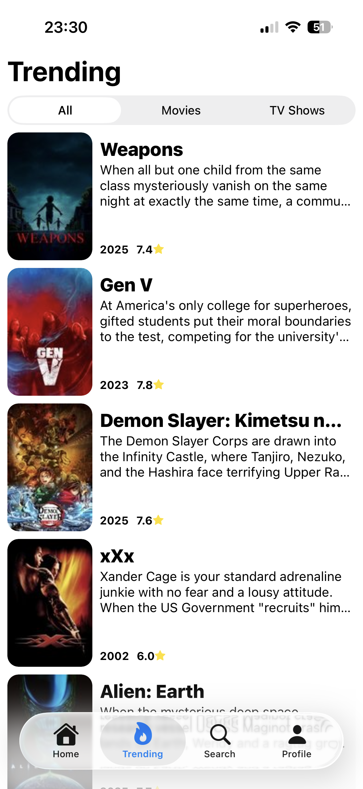
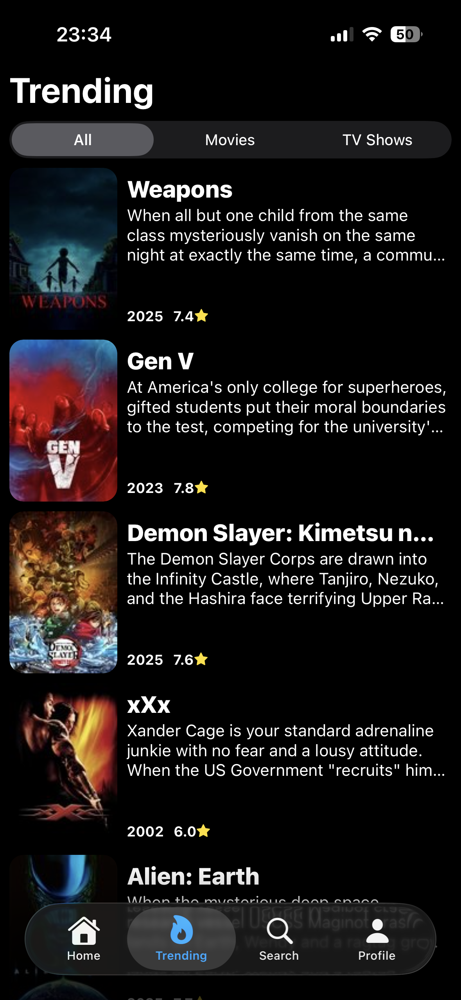

# 🎬 Movie App

This project is mainly for exploring liquid glass in React Native but also to have something to show for.

> [!WARNING]
> Only tested on iOS 26, no idea how it looks/works on older versions/android

## Get started

1. Clone repository.

2. Install [Bun](https://bun.com/) if you havent already.

3. Go to [TMDB](https://www.themoviedb.org/) > sign in > settings > api and grab your api key.

4. Create a .env file in the root and add the following:

   ```
   EXPO_PUBLIC_API_URL=https://api.themoviedb.org/3
   EXPO_PUBLIC_IMAGE_URL=https://image.tmdb.org/t/p
   EXPO_PUBLIC_API_KEY=<<YOUR_KEY_HERE>>
   ```

5. Install dependencies

   ```bash
   bun install
   ```

6. Run the project
   ```bash
   bun run start
   ```

## 🚀 Features (so far)

- Trending page to see whats hot 🔥
- Search page to find what you're looking for 👀
- Fully fledged details page to see reviews, images, recommendations etc ℹ️
- Automatic light/dark theme switching

## 🤓 Shortcomings

API abuse isn't prevented

> If you were to publish this you would probably want a backend that handles the fetching from TMDB to minimize the risk of API abuse. Either implement full auth or at least anonymous user accounts to be able to rate limit/suspend.

## ⚠️ Known issues

Switching theme causes full re-render

> Expo router and React Compiler use a lot of memoization which causes issues with the design system I'm using. I'm waiting for NativeWind v5 to see if that solves the problem, otherwise I'm switching to React Native Stylesheets.

## 🖼️ Some images/gifs

<p align="center">
  
  
</p>

<p align="center">
  
  
</p>

<p align="center">
  
  
</p>

<p align="center">
  
  
</p>

<p align="center">
  
  
</p>
