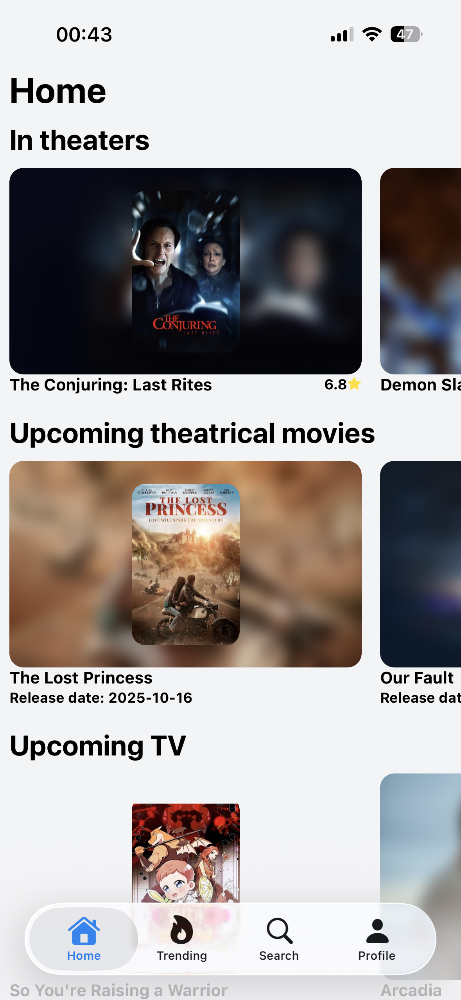
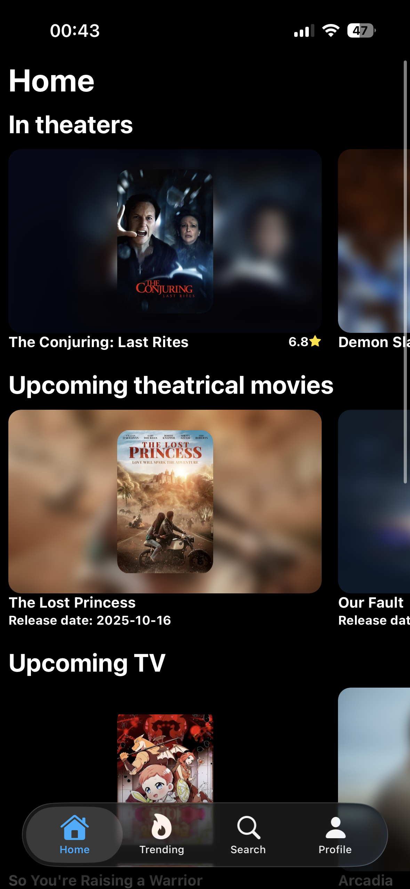
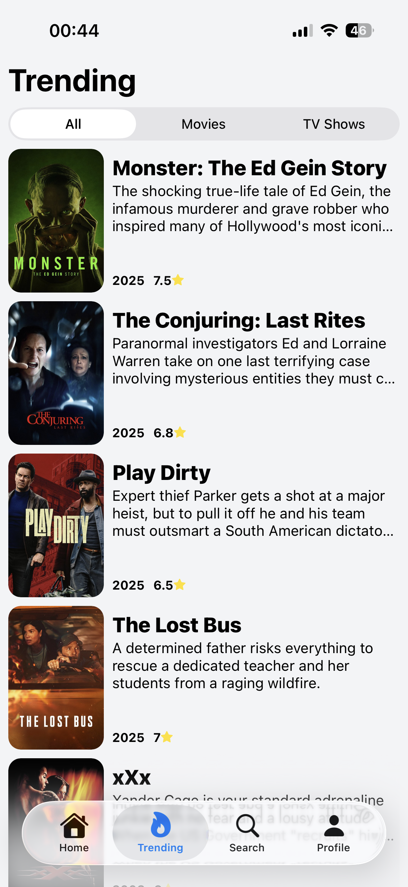
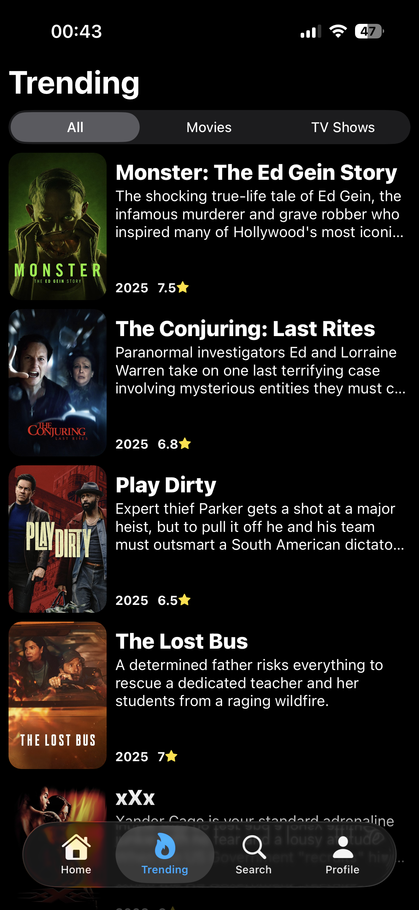

# 🎬 Movie App

This project is mainly for exploring liquid glass in React Native but also to have something to show for.

> [!IMPORTANT]
> Only tested on iOS 26 via Expo Go, no idea how it looks/works on older versions/android

## Get started

1. Clone repository.

2. Install [Bun](https://bun.com/) if you haven't already.

3. Go to [TMDB](https://www.themoviedb.org/) > sign in > settings > api and grab your api key.

4. Create a .env file in the root and add the following:

   ```bash
   EXPO_PUBLIC_API_KEY=<<YOUR_KEY_HERE>>
   ```

5. Install dependencies

   ```bash
   bun install
   ```

6. Run the project

   ```bash
   bun run start
   ```

7. Open the app with Expo Go

## 🚀 Features

- Home page to see now playing, upcoming, top-lists etc...
- Trending page to see whats hot 🔥
- Search page to find what you're looking for 👀
- Fully fledged details page to see reviews, images, recommendations etc ℹ️
- Details page for actors/crew to see social media, images and known-for ℹ️
- Local watchlist
- Theme settings including light/dark, follow device and dark-ish

## 🤓 Shortcomings

API abuse isn't prevented and api key would be bundeled with the app

> If you were to publish this you would probably want a backend that handles the fetching from TMDB to minimize the risk of API abuse and to not leak your api key. You would either implement full auth or at least anonymous user accounts to be able to rate limit/suspend.

## ⚠️ Known issues

Switching theme causes full re-render

> Expo router and React Compiler use a lot of memoization which causes issues with the design system I'm using. I'm waiting for NativeWind v5 to see if that solves the problem, otherwise I'm switching to React Native Stylesheets.

Dates from TMDB are a mess

> The way TMDB handles dates makes it annoying to get what you want so sometimes an already released movie/series will show up in the "Upcoming" section. Easily fixable by fetching all dates for each movie/series and check the actual date.

## 🖼️ Images of the app

<p align="center">
  
  
</p>

<p align="center">
  
  
</p>

<p align="center">
  
</p>

<p align="center">
  
  
</p>

<p align="center">
  
  
</p>

<p align="center">
  
  
</p>

<p align="center">
  
  
</p>

<p align="center">
  
  
</p>

<p align="center">
  
  
</p>
